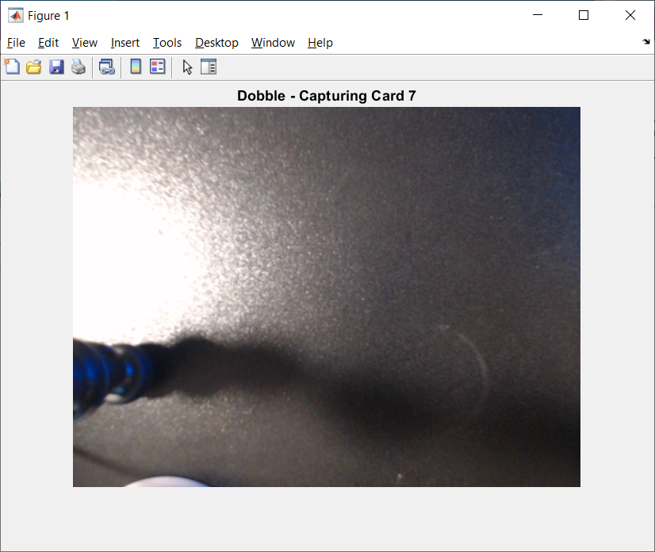
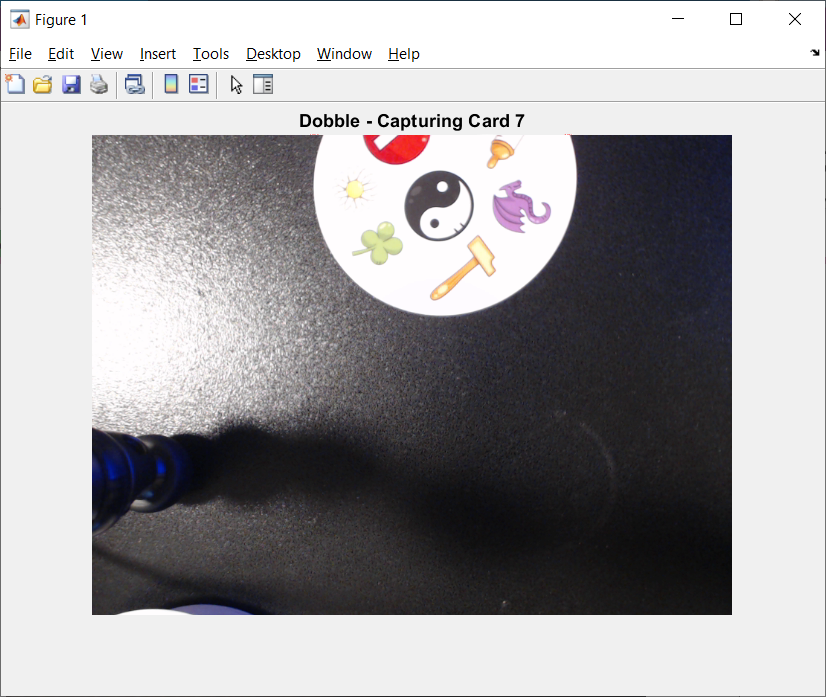
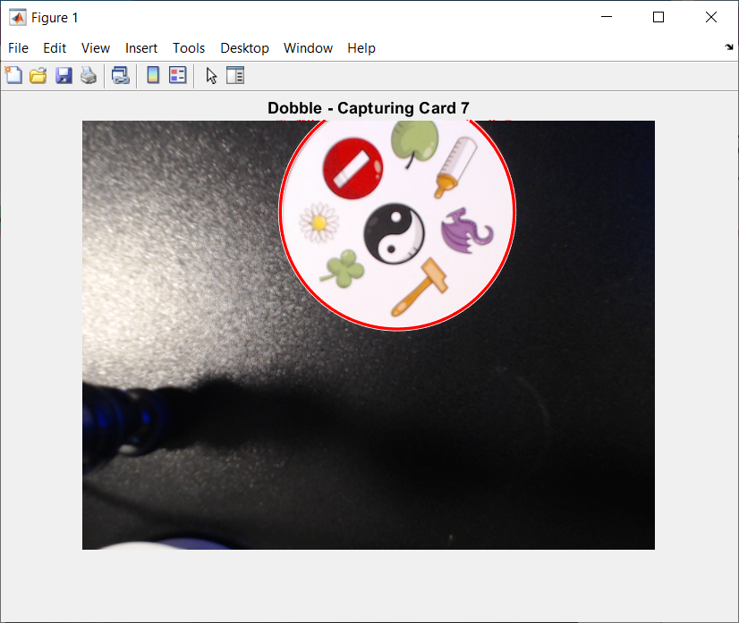
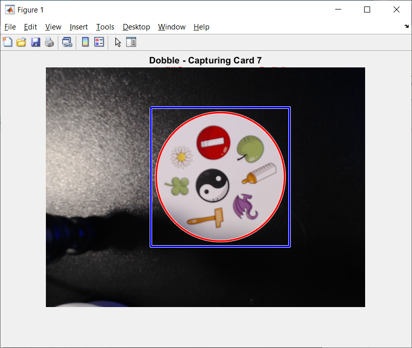
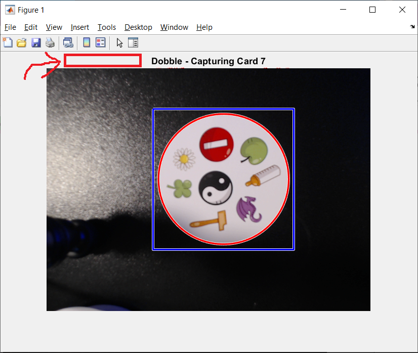

# Dobble capture script for use with Matlab

Requirements:
- MATLAB
- Webcam Support Package
   - if not already installed, will open the Add-On Explorer to install

Edit script for your setup:
- specify webcam by number (ie. 0, 1, ...) or by name
   - list of cameras can be obtained with "webcamlist" command in MATLAB
```
>> webcamlist

ans =
 
  2×1 cell array

    {'HP HD Camera'  }
    {'HD Pro Webcam C920'}
```

Instructions:
- Script will display this interactive figure
	<div align="center">
    
	</div>
		
- In order to capture an image, card must be fully visible.
- The following examples are invalid
	<div align="center">
    
    
	</div>
		
- When valid, the card will have a BLUE RECTANGLE drawn around it, as shown here
	<div align="center">
    
	</div>
		
- To capture image, press to the left of the "Dobble - Capturing Card #" title, as indicated by the red arrow & box shown below … 
	<div align="center">
    
	</div>
		
- Captured image should look like this …
	<div align="center">
    
	</div>
		
